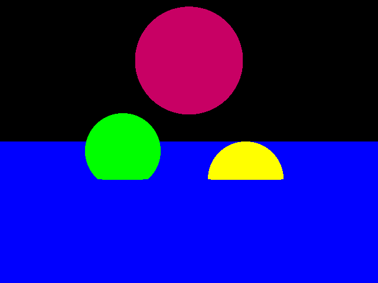
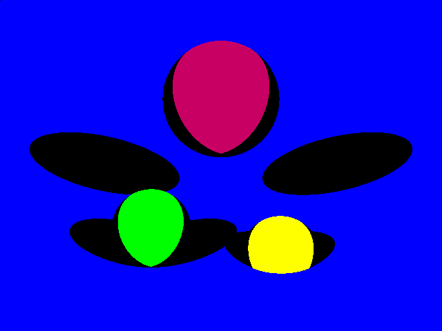
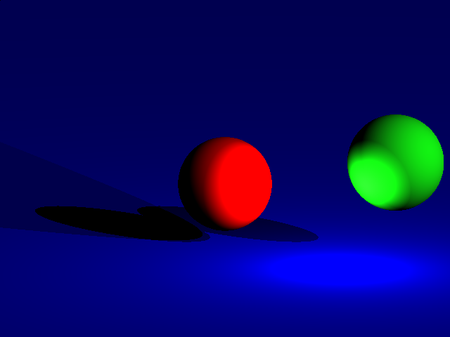
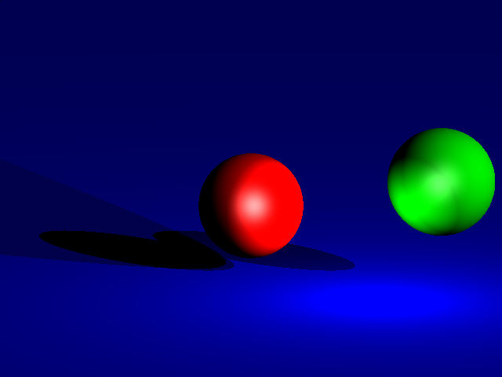

# Rust Raytracer

This is an example project of a raytracer written in Rust.
I've included 8 examples that showcase development, step by step.

The algorithms come from an example raytracer that was written in [Processing4](https://processing.org/) (= A Java framework for creative programming).
It was written by one of my professors at [HTL Rennweg](https://www.htlrennweg.at/).

Because it was originally written in Java, I had to rework how the rendering was going to take place since I'm Rust.
I additionally added some new features such as HDRI sampling for the background.

## Examples

To run an example you have to have the [Rust](https://www.rust-lang.org/learn/get-started) programming language installed, visit it's website in order to find instructions on how to download and install it.
After that you just have to run:
```
cargo run --release --example <EXAMPLE>
```
Replace `<EXAMPLE>` with one of the examples listed in the [Cargo.toml](Cargo.toml) file or in the [examples](examples) folder.

### 01planes
```
cargo run --release --example 01planes
```


### 02spheres
```
cargo run --release --example 02spheres
```


### 03lights
```
cargo run --release --example 03lights
```


### 04pointlights
```
cargo run --release --example 04pointlights
```


### 05diffuse
```
cargo run --release --example 05diffuse
```


### 06specular
```
cargo run --release --example 06specular
```


### 07reflection
```
cargo run --release --example 07reflection
```


### 08background
```
cargo run --release --example 08background
```

